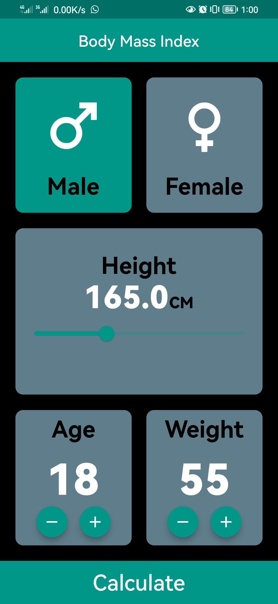
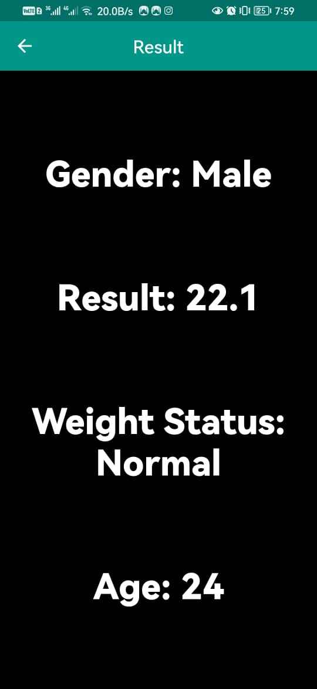

# ⚖️ BMI Calculator

A simple Flutter app to calculate Body Mass Index (BMI) using basic inputs.

## ✨ Features

- 🚻 Gender selection  
- 📏 Height input (cm)  
- ⚖️ Weight input (kg)  
- 🎂 Age input  
- 🧮 Instant BMI result with category (Underweight, Normal, etc.)

## 📸 Screenshots

|  |  |
|:--:|:--:|
| *Simple UI to enter gender, height, weight, and age* | *Clear BMI result with interpretation* |

## 📚 Credits

Built while following the excellent course:  
[Flutter & Dart - The Complete Guide](https://www.udemy.com/course/fluttercourse/)

